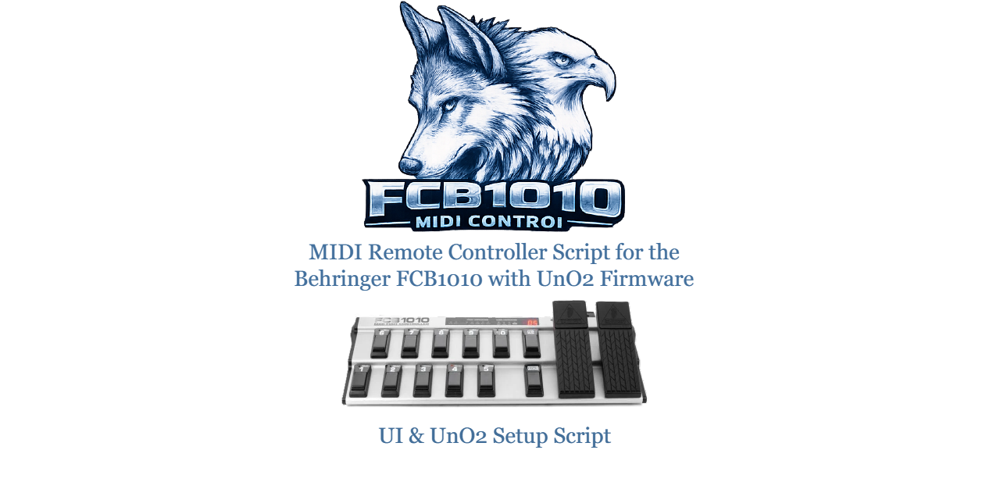

<h1 align="center">Behringer FCB1010 UnO2 - Cubase MIDI Remote Script</h1>

	

<strong>Focused foot control for Cubase transport, tap tempo, and live-friendly workflow.</strong>

<strong>Repository:</strong> jfheinrich-eu/midi-control-fcb1010

## Project Links

- License: [MIT](LICENSE)
- Changelog: [CHANGELOG.md](CHANGELOG.md)
- Contributing: [CONTRIBUTING.md](CONTRIBUTING.md)
- Code of Conduct: [CODE_OF_CONDUCT.md](CODE_OF_CONDUCT.md)
- Security: [SECURITY.md](SECURITY.md)
- Support: [SUPPORT.md](SUPPORT.md)
- Development Guide: [docs/DEVELOPMENT.md](docs/DEVELOPMENT.md)
- Architecture: [docs/ARCHITECTURE.md](docs/ARCHITECTURE.md)

## Idea
This script implements a focused, reliable musician-friendly Cubase transport workflow for a Behringer FCB1010 (UnO2 setup). Footswitches 1 to 9 are active, with deterministic recording stop behavior.

The on-screen surface is intentionally laid out like the real FCB1010 pedalboard: two expression pedal areas at the top and two rows of five footswitches below, so non-technical players can immediately recognize the device.

## Purpose
The main purpose is to make hands-free recording control robust and predictable for instrument players (especially guitarists) who cannot use mouse/keyboard while performing.

Implemented behavior:
- Footswitch 1 press (Note On, value 127): Start Recording
- Footswitch 1 release (Note Off, value 0): Stop Recording
- Immediately after footswitch 1 stops recording: send one Stop Play pulse
- Footswitch 2 press: Start Play
- Footswitch 2 release: additionally trigger one Stop pulse
- Footswitch 3 press: Stop Play + force Record Off + auto-release button state
- Footswitch 4 toggle: Cycle On/Off
- Footswitch 5 press: Tap Tempo
- Footswitch 6 press: Rewind (momentary)
- Footswitch 7 press: Forward (momentary)
- Footswitch 8 press: Undo
- Footswitch 9 toggle: Metronome (Click) On/Off

Implemented surface design:
- The Cubase surface is visually arranged like a real FCB1010.
- Two expression pedal areas are shown at the top.
- Two rows of five footswitches are shown at the bottom.
- Footswitches 1 to 9 are now active and placed like the real pedalboard.

Design goals:
- Deterministic transport behavior
- No MIDI feedback loop
- No repeated stop bursts (debounced)

## Meaningful Script Extensions
Possible next steps to evolve this script into a complete FCB1010 profile:

1. Full functional FCB1010 mapping
- Keep the current pedalboard-like visual layout
- Turn all 10 footswitches into active Cubase controls
- Turn both expression pedals into usable continuous controllers
- Add readable labels that still stay musician-friendly

2. Multi-page mapping setup
- Page A: Recording / Transport
- Page B: Marker navigation (prev/next/insert)
- Page C: Track focus/navigation and monitor toggles
- Page D: QuickControls or plugin parameter banks

3. Multiple controller setups
- UnO2-specific profile (current)
- Stock FCB1010 profile
- Optional profile variants by MIDI channel or note map

4. Workflow safety features
- Configurable debounce timings
- Optional long-press actions
- Optional fail-safe stop command duplication (if host setup needs it)

5. Extended DAW control
- Punch In / Punch Out
- Cycle On/Off
- Metronome toggle
- Marker and locator control

## Usage
### Basic setup
1. Place the script in the Cubase MIDI Remote local scripts folder.
2. Reload scripts in Cubase (MIDI Remote -> Scripting Tools -> Reload Scripts).
3. Add the device in MIDI Remote Manager.
4. Optional: set `LAYOUT` at the top of `Behringer_BehringerFCB1010UnO2.js` (`wide` or `compact`) before reloading scripts.
5. Ensure your FCB1010 sends the configured notes on MIDI channel 10:
	- Footswitch 1 -> Note 36
	- Footswitch 2 -> Note 38
	- Footswitch 3 -> Note 40

### Layout selection
The script currently uses a single device registration and layout selection is controlled in code:

- `LAYOUT = 'wide'` for larger spacing and maximum label readability.
- `LAYOUT = 'compact'` for denser horizontal spacing.

Future enhancement path:

- Registration helper functions for multiple variants are already present in the script.
- If needed, this can be extended to expose separate Cubase device entries.

## MIDI Configuration
This script currently uses footswitches 1 to 9.

Required triggers for the current script:

| Footswitch | Function | MIDI Type | MIDI Channel | Note | Press | Release | Behavior |
| --- | --- | --- | --- | --- | --- | --- | --- |
| 1 | Record | Note | 10 | 36 | 127 | 0 | Momentary |
| 2 | Play | Note | 10 | 38 | 127 | 0 | Momentary |
| 3 | Stop | Note | 10 | 40 | 127 | 0 | Momentary |
| 4 | Cycle | Note | 10 | 41 | 127 | 0 | Toggle |
| 5 | Tap Tempo | Note | 10 | 43 | 127 | 0 | Momentary |
| 6 | Rewind | Note | 10 | 45 | 127 | 0 | Momentary |
| 7 | Forward | Note | 10 | 47 | 127 | 0 | Momentary |
| 8 | Undo | Note | 10 | 48 | 127 | 0 | Momentary |
| 9 | Click | Note | 10 | 50 | 127 | 0 | Toggle |

### What to configure in UnO2 Control Center
In the UnO2 Control Center editor, create or edit the footswitch assignments so that the first three switches send these note events:

1. Select the preset or mode you want to use for Cubase control.
2. Configure FS1..FS9 to notes 36, 38, 40, 41, 43, 45, 47, 48, 50 on MIDI channel 10.
3. Set FS1, FS2, FS3, FS5, FS6, FS7, FS8 to momentary.
4. Set FS4 and FS9 to toggle (or momentary if you prefer host-side toggling).
5. Make sure press sends Note On with velocity/value 127.
6. Make sure release sends Note Off, or an equivalent zero-value release event.

### Important behavior note
This script is designed for press-and-release logic.

That means:
- Footswitch 1 press starts recording.
- Footswitch 1 release stops recording.
- After stop recording, Cubase also receives Stop Play once.
- Footswitch 2 press starts playback.
- Footswitch 2 release sends an additional stop pulse.
- Footswitch 3 press stops playback, also forces record off, and auto-releases.

If the UnO2 switch is configured as toggle/latching instead of momentary, the workflow will not behave correctly.

### Recommended Cubase-dedicated UnO2 setup
If you want one bank dedicated to Cubase, the simplest and most robust approach is:
- Reserve one preset/bank for Cubase transport control.
- Assign footswitches 1 to 9 exactly as described above.
- Footswitch 10 can remain reserved/user-defined for now.

### Suggested note map for a future full 10-switch setup
The workspace already contains a related UnO2 mapping using this note layout on MIDI channel 10:

| Footswitch | MIDI Channel | Note |
| --- | --- | --- |
| 1 | 10 | 36 |
| 2 | 10 | 38 |
| 3 | 10 | 40 |
| 4 | 10 | 41 |
| 5 | 10 | 43 |
| 6 | 10 | 45 |
| 7 | 10 | 47 |
| 8 | 10 | 48 |
| 9 | 10 | 50 |
| 10 | 10 | 52 |

This is not required for the current one-switch script, but it is a sensible base if you want to keep your UnO2 configuration aligned with a future complete FCB1010 Cubase profile.

## Suggested Footswitch Layout
The following layout is meant to stay easy to understand for a regular guitarist. It avoids abstract technical naming and follows typical live or recording priorities.

| Footswitch | Suggested Function | MIDI Channel | Note | Suggested UI Label |
| --- | --- | --- | --- | --- |
| 1 | Record Start / Stop | 10 | 36 | Record |
| 2 | Play | 10 | 38 | Play |
| 3 | Stop | 10 | 40 | Stop |
| 4 | Cycle On / Off | 10 | 41 | Cycle |
| 5 | Tap Tempo | 10 | 43 | Tap |
| 6 | Rewind (momentary) | 10 | 45 | Rewind |
| 7 | Forward (momentary) | 10 | 47 | Forward |
| 8 | Undo | 10 | 48 | Undo |
| 9 | Metronome On / Off | 10 | 50 | Click |
| 10 | Talkback / User Function | 10 | 52 | User |

Notes:
- Footswitches 1 to 9 are implemented in the current script.
- Footswitch 10 is still a reserved extension point.
- The labels are intentionally simple and musician-friendly.

### Expression pedals
The current script only draws both expression pedals in the Cubase surface for visual familiarity.

At the moment:
- Expression pedal A is not mapped to a Cubase function.
- Expression pedal B is not mapped to a Cubase function.

You can leave both pedals unassigned for now, or prepare them later for volume, wah-style plugin control, QuickControls, or monitor/send levels.

### Example workflow (your scenario)
Guitar tube amp setup -> line out -> Cubase Elements 14 with this MIDI Remote script -> OBS (streaming/recording).

Control architecture:
- Behringer FCB1010 is the physical foot controller.
- MIDIKey2Key is used to control OBS.
- This MIDI Remote script controls Cubase transport/record logic.

Result:
- Recording start and stop can be performed in sync from the foot controller.
- Cubase recording and OBS capture can be started/stopped as one practical workflow chain.

## Credits
- Script author: JFHeinrich
- Script engineering and iterative refinement were created with help from GitHub Copilot.
